## Part 1. Инструмент ipcalc

### 1.1. Сети и маски

#### адрес сети
- Устанавливаем ipcalc и выводим адрес сети 192.167.38.54/13 \

####  перевод маски
- 255.255.255.0 в префиксную и двоичную запись \

- /15 в обычную и двоичную запись \

- 11111111.11111111.11111111.11110000 в обычную и префиксную запись \

#### минимальный и максимальный хост в сети 12.167.38.4 при масках:

- /8 \

- 11111111.11111111.00000000.00000000 \

- 255.255.254.0 \

- /4 \

### 1.2. localhost

- Определить, можно ли обратиться к приложению, работающему на localhost, со следующими IP: 

``194.34.23.100, 128.0.0.1`` - нет \
``127.0.0.2, 127.1.0.1`` - да 

### 1.3. Диапазоны и сегменты сетей

- Определить какие из IP можно использовать в качестве публичного, а какие только в качестве частных: 

``134.43.0.2, 172.0.2.1, 192.172.0.1, 172.68.0.2, 192.169.168.1`` - в качестве публичного \
``10.0.0.45, 192.168.4.2, 172.20.250.4, 172.16.255.255, 10.10.10.10`` - в качестве частных 

- Определить какие из IP адресов шлюза возможны у сети 10.10.0.0/18: 

``10.10.0.2, 10.10.10.10, 10.10.1.255`` - возможны \
``10.0.0.1, 10.10.100.1`` - невозможны 

## Part 2. Статическая маршрутизация между двумя машинами

- Поднять две виртуальные машины (далее -- ws1 и ws2) \
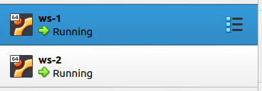

- Вывод команды ip a \
 \
 

**lo или local loopback** (локальная петля). Служит для подключения по сети к этому же компьютеру и не требует дополнительной настройки \
``ws1: 127.0.0.1/8`` \
``ws2: 127.0.0.1/8`` 

**enp0s3** - первый сетевой адаптер работающий в NAT режиме \
``ws1: 10.0.2.15/24`` \
``ws1: 10.0.2.15/24`` 

- Задаем следующие адреса и маски: ws1 - 192.168.100.10, маска /16, ws2 - 172.24.116.8, маска /12 \
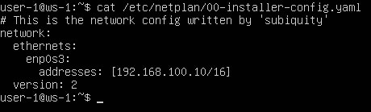 \
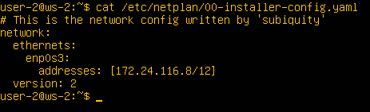 

- ``netplan apply`` для перезапуска сервиса сети \
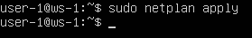 \
 

### 2.1. Добавление статического маршрута вручную

- Добавить статический маршрут от одной машины до другой и обратно, пропинговать соединение между ними \
 \
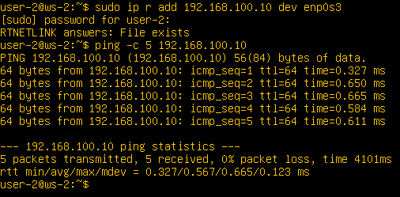 

### 2.2. Добавление статического маршрута с сохранением

- Перезапустить машины \
``sudo reboot``

- Добавить статический маршрут от одной машины до другой с помощью файла etc/netplan/00-installer-config.yaml \
 \

- Пропинговать соединение между машинами \
 \
 

## Part 3. Утилита iperf3

### 3.1. Скорость соединения

- Перевести и записать в отчёт: 8 Mbps в MB/s, 100 MB/s в Kbps, 1 Gbps в Mbps 

``8 Mbps = 1 MB/s`` \
``100 MB/s = 800 000 Kbps`` \
``1 Gbps = 1000 Mbps``

### 3.2. Утилита iperf3 

- Измерить скорость соединения между ws1 и ws2 

 \
 

## Part 4. Сетевой экран

### 4.1. Утилита iptables

- Создать файл /etc/firewall.sh, имитирующий фаерволл, на ws1 и ws2: 

 \
 

- Запустить файлы на обеих машинах командами chmod +x /etc/firewall.sh и /etc/firewall.sh 

 \
 

- Разница в том, что в первом файле, первым подходящим правилом для пакета является запрет, а во втором - разрешение. Применяется только первое подходящее правило, остальные игнорируются

### 4.2. Утилита nmap

- Командой ping найти машину, которая не "пингуется", после чего утилитой nmap показать, что хост машины запущен 

 \
 

## Part 5. Статическая маршрутизация сети

 

- Поднять пять виртуальных машин (3 рабочие станции (ws11, ws21, ws22) и 2 роутера (r1, r2)) 

 

### 5.1. Настройка адресов машин

- Настроить конфигурации машин в etc/netplan/00-installer-config.yaml согласно сети на рисунке 

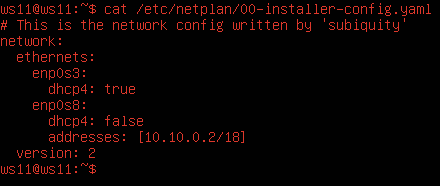 

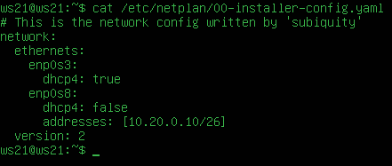 

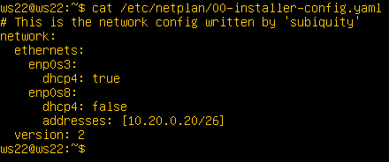 

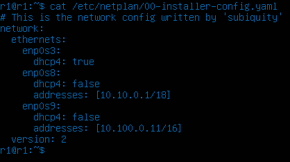 

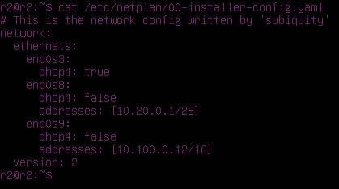 

- Перезапустить сервис сети. Если ошибок нет, то командой ``ip -4 a`` проверить, что адрес машины задан верно

 

 

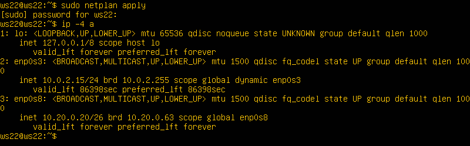 

 

 

- Пропинговать ws22 с ws21. Аналогично пропинговать r1 с ws11

 

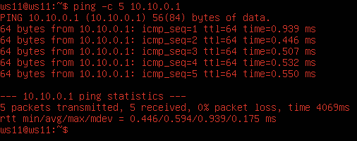 

### 5.2. Включение переадресации IP-адресов

- Для включения переадресации IP, выполните команду ``sysctl -w net.ipv4.ip_forward=1`` на роутерах

 

 

- Откройте файл /etc/sysctl.conf и добавьте в него следующую строку: ``net.ipv4.ip_forward = 1``

 

### 5.3. Установка маршрута по-умолчанию

- Настроить маршрут по-умолчанию (шлюз) для рабочих станций. Для этого добавить default перед IP роутера в файле конфигураций

 

 

 

- Вызвать ``ip r`` и показать, что добавился маршрут в таблицу маршрутизации

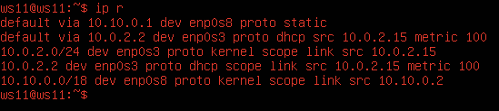 

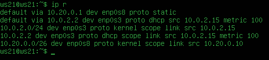 

 

- Пропинговать с ws11 роутер r2 и показать на r2, что пинг доходит. Для этого использовать команду: ``tcpdump -tn -i enp0s9``

 

 

### 5.4. Добавление статических маршрутов

- Добавить в роутеры r1 и r2 статические маршруты в файле конфигураций

 

 

- Вызвать ip r и показать таблицы с маршрутами на обоих роутерах

 

 

- Запустить команды на ws11: ``ip r list 10.10.0.0/[маска сети]`` и ``ip r list 0.0.0.0/0`` 

 

Маршрут по умолчанию имеет более низкий приоритет и срабатывает, если не найден подходящий маршрут в таблице маршрутизации. Для сети 10.10.0.0 мы написали правило, соответственно используется созданный маршрут.

### 5.5. Построение списка маршрутизаторов

- Запустить на r1 команду дампа: ``tcpdump -tnv -i enp0s8``, при помощи утилиты traceroute построить список маршрутизаторов на пути от ws11 до ws21

 

 

- Каждый пакет проходит на своем пути определенное количество узлов, пока достигнет своей цели. Причем, каждый пакет имеет свое время жизни. Это количество узлов, которые может пройти пакет перед тем, как он будет уничтожен. Этот параметр записывается в заголовке TTL, каждый маршрутизатор, через который будет проходить пакет уменьшает его на единицу. При TTL=0 пакет уничтожается, а отправителю отсылается сообщение Time Exceeded.

### 5.6. Использование протокола ICMP при маршрутизации

- Запустить на r1 перехват сетевого трафика, проходящего через eth0 с помощью команды: ``tcpdump -n -i enp0s8 icmp``

 

- Пропинговать с ws11 несуществующий IP (например, 10.30.0.111) с помощью команды: ``ping -c 1 10.30.0.111``

 
